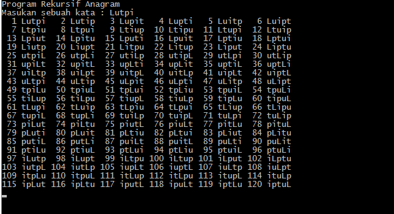

# Rekursif anagram

- Program untuk melihat peluang kata yang diacak dari sebuah inputan beberapa huruf(kata).
- Pegertian anagram : Anagram adalah salah satu jenis permainan kata yang huruf-huruf di kata awal biasanya diacak untuk membentuk kata lain atau sebuah kalimat. Anagram sering dipakai sebagai kode. Permainan yang menggunakan anagram antara lain adalah scrabble dan boggle [Wikipedia](https://id.wikipedia.org/wiki/Anagram)

